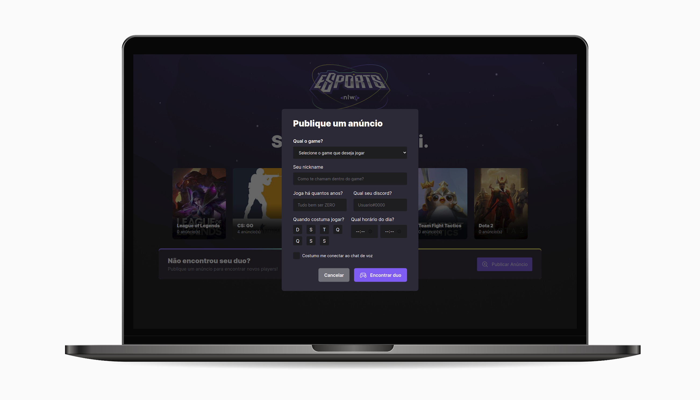
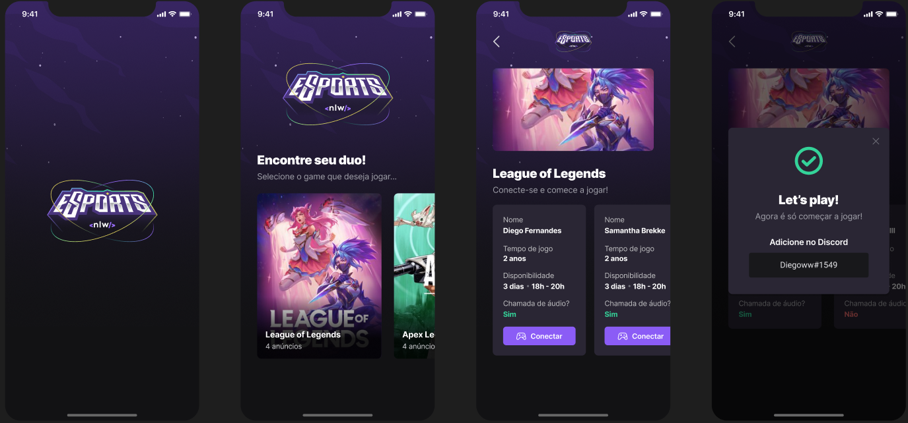

# Duo Finder

Duo Finder is a simple mobile and web application for gamers looking for partners to play a game with.

It's basics was developed during the NEXT LEVEL WEEK IGNITE, an online event provided by RocketSeat for programmers to build a whole functional system within a week.

I will be adding new features in the near future. ;)

---

# Web Application:

</img>
</img>
</img>
</img>

The web features currently include:

- List of available games and it's number of ads;
- Publish a new ad (looking for a Duo).

---

# Mobile Application:

</img>
</img>
</img>

The mobile features currently include:

- List of available games and it's number of ads;
- Interact with games to show each ad;
- Interact with ad to show it's Discord.

---

# API

</img>
</img>
</img>
</img>

The API holds our database and controls it.